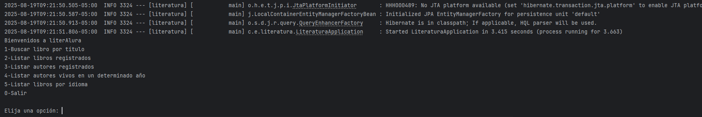
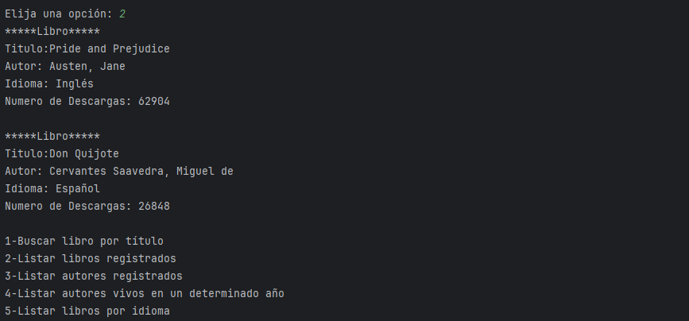

# 📚 Literalura – Challenge  Oficial Alura2025  

<p align="center">
  
</p>

<p align="center">
  
  
  
</p>

---

## 📑 Índice
- [📖 Descripción](#-descripción)
- [🚧 Estado](#-estado)
- [✨ Características](#-características)
- [🖼️ Demo / Capturas](#️-demo--capturas)
- [⚙️ Instalación y ejecución](#️-instalación-y-ejecución)
- [🛠️ Tecnologías usadas](#️-tecnologías-usadas)
- [👨‍💻 Autor](#-autor)
- [📜 Licencia](#-licencia)

---

## 📖 Descripción
**Literalura** es una aplicación desarrollada como parte del *Challenge Alura 2025*.  
El objetivo del proyecto es construir un **catálogo literario interactivo** que permite:  
- Consultar libros y autores desde una base de datos.  
- Buscar información mediante una API externa.  
- Explorar y gestionar colecciones literarias en una interfaz simple de consola.  

---

## ✅ Estado
<h4 align="center">
  🎉 Proyecto Finalizado 🎉
</h4>

---

## ✨ Características
✔️ Registro y consulta de libros.  
✔️ Búsqueda de autores y filtrado por nacionalidad.  
✔️ Integración con una API externa para datos literarios.  
✔️ Persistencia en base de datos (PostgreSQL).  
✔️ Interfaz interactiva en consola.  

---

## 🖼️ Demo / Capturas

<p align="center">
  
</p>

<p align="center">
  
</p>

<p align="center">
  
</p>


---

## ⚙️ Instalación y ejecución

### 🔹 Requisitos previos
- Tener instalado **Java 21** o superior  
- Tener **Maven** configurado  
- Base de datos **PostgreSQL**  

### 🔹 Pasos de instalación
1. Clonar el repositorio:  
   ```bash
   git clone https://github.com/DVILLEGAS1207/literalura.git
2. Acceder al directorio:
   cd literalura
3. Construir el proyecto con Maven:
   mvn clean install
4. Ejecutar la aplicación:
   mvn spring-boot:run
